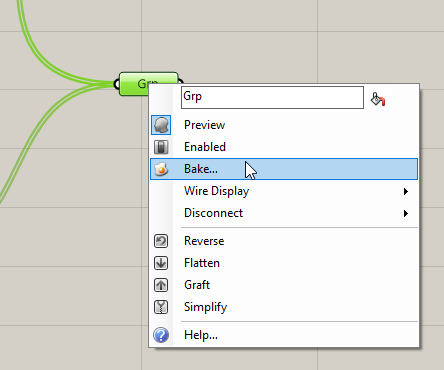
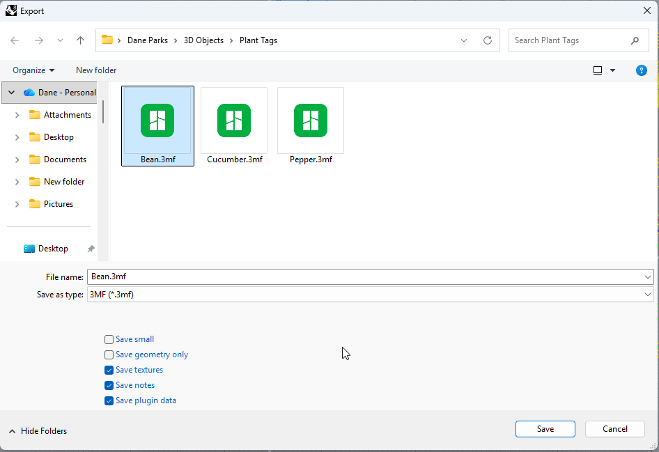
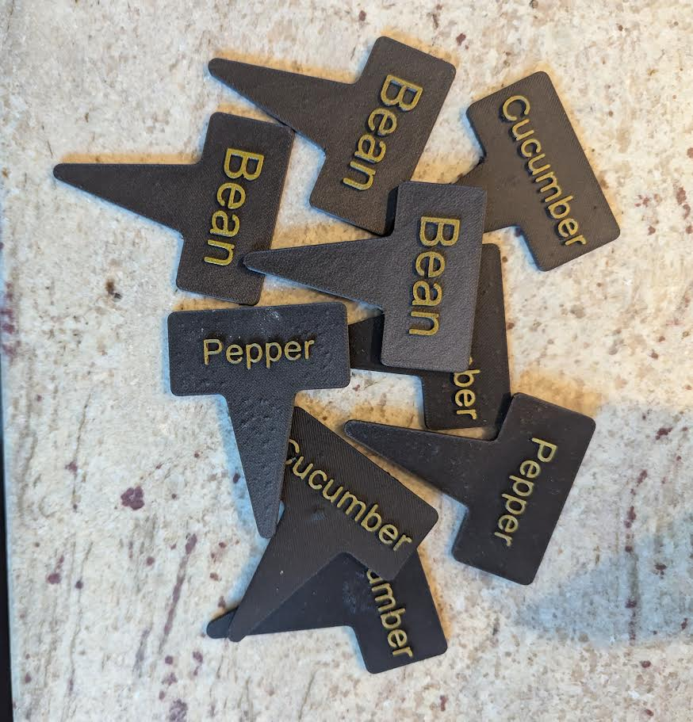

# Garden Plant RFID Tags

Parametric 3D printable RFID-enabled tags for garden asset management.

## Overview

This project provides a system for generating and using 3D printable tags with embedded RFID/NFC chips. These tags are designed to be used in gardens to track and manage plants easily using mobile apps (like NFC Tools).

The tags are generated using Grasshopper (Rhino 3D), allowing for easy customization of text labels and dimensions.

## Project Structure

- `grasshopper/`: Contains the Grasshopper (.gh) script used to generate the tags.
- `stls/`: Contains pre-generated 3MF/STL files for common plant names.
- `screenshots/`: Contains images demonstrating the Grasshopper component and usage.

## Grasshopper Workflow

Grasshopper is a visual programming language that runs inside of Rhinoceros 3D. It allows for parametric design, meaning you can change variables (like text or size) and the 3D model updates automatically.

### 1. Grasshopper Overview

*The full layout of the tag generator script.*

### 2. User Input

*The main editable fields where users can change the tag text and text size.*

### 3. Non-standard Editing

*Advanced settings for when using a different size RFID tag in the cavity.*

### 4. Baking

*The process of "Baking" the parametric geometry into a static Rhino object.*

### 5. Export

*Exporting the baked geometry as a mesh file for slicing.*

### 6. Add Pause

*Adding a pause command in the slicer at the top of the RFID cavity.*

### 7. Inserting RFID Chip

*Placing the RFID chip into the cavity during the printer's pause.*

### 8. Finished Tags

*The final 3D printed and functional RFID tags.*

## Data Storage Ideas

These tags can store a variety of useful information for garden management. You can use the free **NFC Tools** app (available on Android and iOS) to write and read data such as:

- **Plant Variety**: Specific strain or cultivar names.
- **Schedules**: Tracking watering and fertilization routines.
- **Important Dates**: When to switch fertilizers, expected harvest dates, or pollination records.
- **Care Instructions**: Light requirements or specific pruning notes.

## License

This project is licensed under the GNU Affero General Public License v3.0 (AGPL-3.0). See the [LICENSE](LICENSE) file for details.
